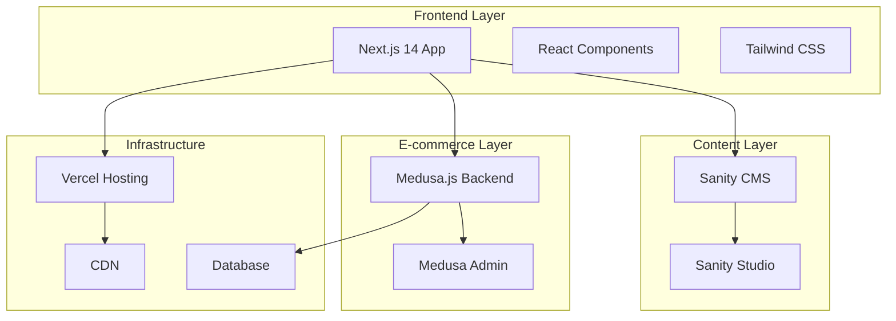

# 🏛️ Fitfoot System Architecture

**Created:** 2024-12-28  
**Last Modified:** 2024-12-28  
**Last Modified Summary:** Initial system architecture documentation

## 📋 Overview

Fitfoot is a modern e-commerce platform built with a **headless architecture** combining Next.js for the frontend, Sanity for content management, and Medusa.js for e-commerce functionality. The system follows **JAMstack principles** with static generation and serverless functions.

## 🏗️ High-Level Architecture



## 🔧 Technology Stack

### **Frontend**
- **Framework:** Next.js 14 (App Router)
- **Language:** TypeScript
- **Styling:** Tailwind CSS + shadcn/ui
- **State Management:** React Server Components + Client Components
- **Build Tool:** Turborepo (Monorepo)

### **Content Management**
- **CMS:** Sanity Studio v3
- **Query Language:** GROQ
- **Content Delivery:** Sanity CDN
- **Real-time Updates:** Sanity Webhooks

### **E-commerce**
- **Backend:** Medusa.js v2
- **Database:** PostgreSQL (production) / SQLite (development)
- **API:** REST + GraphQL
- **Admin Panel:** Medusa Admin

### **Infrastructure**
- **Hosting:** Vercel (Frontend)
- **CDN:** Vercel Edge Network
- **Database:** Vercel Postgres / Railway
- **Monitoring:** Vercel Analytics

## 📁 Project Structure

```
fitfoot/
├── apps/
│   └── web/                 # Next.js frontend application
│       ├── src/
│       │   ├── app/         # App Router pages
│       │   ├── components/  # React components
│       │   └── lib/         # Utilities and API clients
│       ├── public/          # Static assets
│       └── package.json
├── packages/
│   └── sanity/              # Sanity Studio CMS
│       ├── schemas/         # Content schemas
│       ├── schemaTypes/     # Schema type definitions
│       └── sanity.config.ts
├── docs/                    # Documentation
├── scripts/                 # Utility scripts
├── package.json             # Root workspace config
└── turbo.json              # Turborepo configuration
```

## 🔄 Data Flow Architecture

### **Content Flow**
1. **Content Creation:** Editors create content in Sanity Studio
2. **Content Storage:** Content stored in Sanity's cloud database
3. **Content Delivery:** Next.js fetches content via GROQ queries
4. **Static Generation:** Pages pre-rendered at build time
5. **Dynamic Updates:** Real-time updates via webhooks (future)

### **E-commerce Flow**
1. **Product Management:** Products managed in Medusa Admin
2. **API Integration:** Next.js fetches products via Medusa API
3. **Cart Management:** Client-side cart state management
4. **Checkout Process:** Secure checkout via Medusa backend
5. **Order Processing:** Orders processed and fulfilled

## 🎯 Design Patterns

### **Component Architecture**
- **Atomic Design:** Components organized by complexity (atoms → molecules → organisms)
- **Server Components:** Default for data fetching and static content
- **Client Components:** Used for interactivity and state management
- **Composition Pattern:** Flexible component composition with slots

### **Data Fetching Patterns**
- **Server-Side Rendering:** Dynamic pages with fresh data
- **Static Site Generation:** Static pages for better performance
- **Incremental Static Regeneration:** Hybrid approach for content updates
- **Client-Side Fetching:** Interactive features and real-time updates

### **Error Handling Patterns**
- **Error Boundaries:** React error boundaries for component errors
- **API Error Handling:** Consistent error responses and fallbacks
- **Graceful Degradation:** Fallback content when APIs are unavailable
- **Loading States:** Proper loading indicators and skeleton screens

## 🔒 Security Architecture

### **Authentication & Authorization**
- **Admin Access:** Sanity and Medusa admin authentication
- **API Security:** API keys and environment variables
- **CORS Configuration:** Proper cross-origin resource sharing
- **Content Security Policy:** Security headers (to be implemented)

### **Data Protection**
- **Environment Variables:** Sensitive data in environment variables
- **API Rate Limiting:** Protection against abuse (to be implemented)
- **Input Validation:** Server-side validation for all inputs
- **HTTPS Enforcement:** SSL/TLS encryption for all communications

## 📈 Performance Architecture

### **Frontend Performance**
- **Code Splitting:** Automatic code splitting with Next.js
- **Image Optimization:** Next.js Image component with optimization
- **Bundle Analysis:** Bundle size monitoring and optimization
- **Caching Strategy:** Browser caching and CDN caching

### **Backend Performance**
- **Database Optimization:** Efficient queries and indexing
- **API Caching:** Response caching for frequently accessed data
- **CDN Integration:** Global content delivery network
- **Serverless Functions:** Auto-scaling serverless architecture

## 🔧 Development Architecture

### **Monorepo Structure**
- **Turborepo:** Efficient build system and task runner
- **Shared Dependencies:** Common dependencies managed at root level
- **Independent Deployments:** Apps can be deployed independently
- **Consistent Tooling:** Shared linting, formatting, and testing configs

### **Development Workflow**
- **Git Flow:** Feature branches with pull request reviews
- **Continuous Integration:** Automated testing and building
- **Continuous Deployment:** Automatic deployment on merge
- **Environment Parity:** Development, staging, and production environments

## 🚀 Deployment Architecture

### **Frontend Deployment**
- **Platform:** Vercel with automatic deployments
- **Build Process:** Next.js build with static optimization
- **Environment Variables:** Secure environment configuration
- **Preview Deployments:** Automatic preview for pull requests

### **CMS Deployment**
- **Sanity Studio:** Deployed to Sanity's hosting
- **Content API:** Sanity's global CDN
- **Webhooks:** Real-time content updates (to be implemented)
- **Backup Strategy:** Automated content backups

### **E-commerce Deployment**
- **Backend Hosting:** Railway, DigitalOcean, or AWS
- **Database:** Managed PostgreSQL instance
- **File Storage:** Cloud storage for product images
- **Payment Processing:** Stripe integration

## 🔮 Future Architecture Considerations

### **Scalability**
- **Microservices:** Potential split into smaller services
- **Database Sharding:** Horizontal database scaling
- **Caching Layer:** Redis for advanced caching
- **Load Balancing:** Multiple server instances

### **Advanced Features**
- **Real-time Updates:** WebSocket connections for live updates
- **Search Engine:** Elasticsearch for advanced product search
- **Analytics:** Advanced user behavior tracking
- **Internationalization:** Multi-language and multi-currency support

---

## 📚 Related Documentation

- [🔄 Data Flow](./data-flow.md)
- [🎨 Design System](./design-system.md)
- [📱 Component Architecture](./components.md)
- [💻 Development Guidelines](../development/guidelines.md)

---

**Last Updated:** 2024-12-28 | **Next Review:** 2025-01-28 