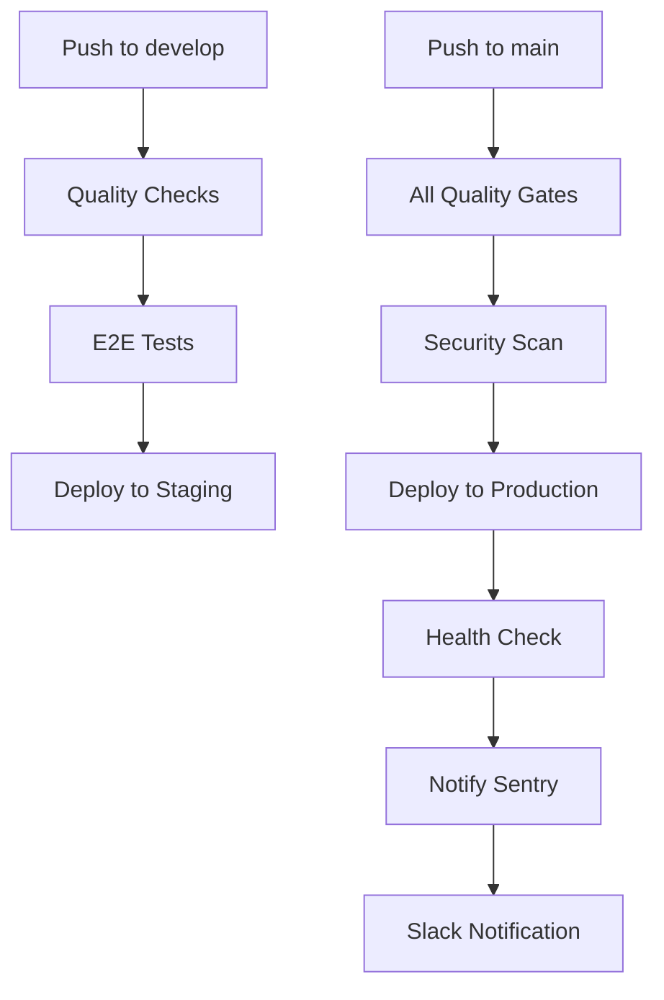

# CI/CD Pipeline Setup Guide

**Created**: 2024-01-15  
**Last Modified**: 2024-01-15  
**Last Modified Summary**: Initial CI/CD pipeline setup documentation

## Overview

This guide sets up a comprehensive CI/CD pipeline for FitFoot that implements:
- ✅ Automated quality checks (linting, testing, type checking)
- ✅ End-to-end testing with Playwright
- ✅ Performance monitoring with Lighthouse
- ✅ Security scanning with npm audit and Snyk
- ✅ Automated deployment to staging and production
- ✅ Slack notifications and Sentry integration

## Prerequisites

### 1. GitHub Secrets Setup

Add these secrets to your GitHub repository:

```bash
# Vercel Integration
VERCEL_TOKEN=your_vercel_token
VERCEL_ORG_ID=your_vercel_org_id
VERCEL_PROJECT_ID=your_vercel_project_id

# Sentry Integration
SENTRY_AUTH_TOKEN=your_sentry_auth_token
SENTRY_ORG=your_sentry_org_name

# Security Scanning
SNYK_TOKEN=your_snyk_token

# Notifications
SLACK_WEBHOOK_URL=your_slack_webhook_url
```

### 2. Branch Protection Rules

Set up branch protection for `main`:
- ✅ Require status checks before merging
- ✅ Require branches to be up to date
- ✅ Include administrators
- ✅ Restrict pushes that create files

## Pipeline Overview

### Quality Gates

1. **Code Quality**
   - ESLint linting
   - TypeScript type checking
   - Unit test coverage (80% threshold)
   - Code security scanning

2. **Integration Testing**
   - End-to-end tests with Playwright
   - API integration tests
   - Cross-browser compatibility

3. **Performance Testing**
   - Lighthouse CI (LCP < 2.5s, FID < 100ms)
   - Core Web Vitals monitoring
   - Bundle size analysis

### Deployment Strategy



## Implementation Steps

### 1. Install Dependencies

```bash
# Web app dependencies
cd apps/web
npm install --save-dev @playwright/test lighthouse lhci codecov

# Medusa dependencies
cd ../medusa
npm install --save-dev @types/jest jest ts-jest
```

### 2. Configure Lighthouse CI

Create `apps/web/lighthouserc.js`:

```javascript
module.exports = {
  ci: {
    collect: {
      url: ['http://localhost:3005'],
      startServerCommand: 'npm run start',
    },
    assert: {
      assertions: {
        'categories:performance': ['warn', {minScore: 0.8}],
        'categories:accessibility': ['error', {minScore: 0.9}],
        'categories:best-practices': ['warn', {minScore: 0.8}],
        'categories:seo': ['warn', {minScore: 0.8}],
      },
    },
    upload: {
      target: 'temporary-public-storage',
    },
  },
};
```

### 3. Environment Variables

Update your `.env.template` with CI/CD related variables:

```bash
# CI/CD Configuration
NODE_ENV=production
NEXT_TELEMETRY_DISABLED=1
PLAYWRIGHT_SKIP_BROWSER_DOWNLOAD=false

# Monitoring
SENTRY_DSN=your_sentry_dsn
SENTRY_ENVIRONMENT=production

# Performance
LIGHTHOUSE_CI_TOKEN=optional_lighthouse_token
```

### 4. Testing Configuration

Ensure your `vitest.config.ts` includes coverage settings:

```typescript
export default defineConfig({
  test: {
    coverage: {
      reporter: ['text', 'lcov', 'html'],
      thresholds: {
        global: {
          branches: 80,
          functions: 80,
          lines: 80,
          statements: 80,
        },
      },
    },
  },
});
```

## Deployment Environments

### Staging Environment
- **URL**: `https://staging-fitfoot.vercel.app`
- **Purpose**: Pre-production testing
- **Triggers**: Push to `develop` branch
- **Features**: 
  - All quality checks must pass
  - E2E tests run automatically
  - Performance benchmarks validated

### Production Environment
- **URL**: `https://fitfoot.ch`
- **Purpose**: Live application
- **Triggers**: Push to `main` branch
- **Features**:
  - All quality gates enforced
  - Security scanning required
  - Post-deployment health checks
  - Automatic Sentry release tracking

## Monitoring & Notifications

### Success Notifications
- ✅ Slack notification on successful deployment
- ✅ Sentry release tracking
- ✅ Performance metrics logged

### Failure Notifications
- ❌ Slack alert with failed step details
- ❌ Test results uploaded as artifacts
- ❌ Deployment blocked until issues resolved

## Local Development Workflow

```bash
# Before committing
npm run quality:check

# Fix any issues
npm run quality:fix

# Run E2E tests locally
npm run test:e2e:ui

# Check performance locally
npm run lighthouse
```

## Benefits Achieved

1. **Quality Assurance**
   - Zero console.log statements in production
   - 80%+ test coverage enforcement
   - Type safety guaranteed

2. **Reliability**
   - Automated testing prevents regressions
   - Health checks ensure deployment success
   - Rollback capability on failures

3. **Performance**
   - Core Web Vitals monitoring
   - Bundle size tracking
   - Lighthouse performance gates

4. **Security**
   - Automated vulnerability scanning
   - Dependency audit checks
   - Secure secret management

5. **Developer Experience**
   - Fast feedback on pull requests
   - Automated deployment workflow
   - Clear failure notifications

## Next Steps

After implementing this CI/CD pipeline:

1. **Monitor Performance**: Use the performance tests to establish baselines
2. **Iterate on Tests**: Add more E2E scenarios based on user journeys
3. **Security Hardening**: Implement additional security scans
4. **Advanced Monitoring**: Set up Option 3 for comprehensive observability

## Troubleshooting

### Common Issues

1. **Vercel Deployment Fails**
   - Check `VERCEL_TOKEN` has correct permissions
   - Verify `VERCEL_PROJECT_ID` matches your project

2. **E2E Tests Timeout**
   - Increase timeout in `playwright.config.ts`
   - Check service startup timing

3. **Coverage Threshold Failures**
   - Review untested code paths
   - Update thresholds if needed temporarily

### Support

For issues with this pipeline:
- Check GitHub Actions logs
- Review deployment logs in Vercel
- Monitor Sentry for runtime errors
- Use `npm run quality:check` locally first 